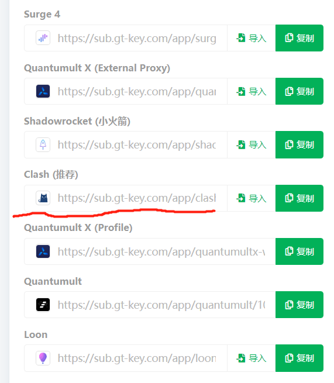
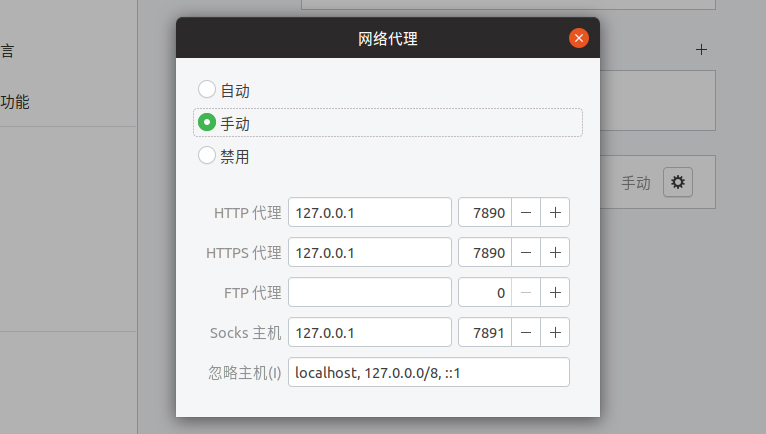

# Ubuntu 上 clash 配置教程
### Step1

将本包解压/`git clone`到任意目录下，本教程中默认为`~/clash`

注1：理论上只需要`clash`这个文件即可，但没试过

注2：若本教程所在目录下仅有`README.md`文件，则需要用户去`clash`的软件官网[GitHub - Dreamacro/clash: A rule-based tunnel in Go.](https://github.com/Dreamacro/clash.git)自行下载

### Step2 下载配置文件

去“机场”网站下单后拿到对应网址链接（尽量选择`clash`，其他的没试过）

“机场”网站推荐见`附录`

<p align = "center">

</p>


在浏览器打开对应链接，`ctrl+s`保存为`config.yaml`到`~/clash`目录下

### Step3 修改网络代理

`ubuntu`桌面右上角打开设置，找到`网络->网络代理`

（具体可能因`ubuntu`版本不同而有差异，请自行探索）



选择`网络代理`模式为`手动`,分别修改下列参数

`http`127.0.0.1:7890
`https`127.0.0.1:7890
`Socks`127.0.0.1:7891

具体如上图所示（最后一行不用管）

### Step4 启动

打开终端/命令行（`ctrl+alt+T`）

输入：

```
cd ~/clash (可能每个人存储的位置不同)
chmod +x clash
./clash -d .
```

注意：最后一个命令中 在`-d`后面还有一个点`.`

无报错即可自由上网

### （Optional）Step5 自定义网络设置

访问[Clash Dashboard](http://clash.razord.top/) `http://clash.razord.top/`可以进行节点切换、延迟测试等操作。

Host: `127.0.0.1`，端口: `9090`

**[2023-3-10注]**
Dashboard 可能进不去，对应的解决方法在附录


### （Optional）Step6 彻底关掉梯子

`crtl+c`关掉上述进程

ubuntu`桌面右上角打开设置，找到`网络->网络代理，选择`网络代理`模式为`自动`或`禁用`（具体看你原本是哪个）

### 附录

##### 网站推荐

https://shuttlehub.github.io/ 正在用，可包流量包，但没有非常稳定

https://fastlink.la/ 曾经用过，不知道现在还能不能用

https://sdyun.cc/ 没用过

https://xn--d4ty0ojsqzfd.com 没用过，但有人推荐

https://glados.one  很多人用

（持续更新...）

##### Dashboard 无法进入解决措施

1.尝试网址`https://clash.razord.top/`

2.用`Firefox`浏览器

若还是不行，请继续下面的步骤

3.将Dashboard的文件下载至本地（clash安装目录下）
```
wget https://github.com/haishanh/yacd/releases/download/v0.3.7/yacd.tar.xz  //可以下载其他版本
tar xvJf yacd.tar.xz    //解压
mv public dashboard     //重命名
```
然后对`config.yaml`文件进行修改
```
mode: Rule
log-level: info
secert: 123456 // 增加这一行, 如果你希望你的clash web要密码访问可以在这块配置密码, 如果不需要直接注释掉即可
external-ui: dashboard // 增加这一行
external-controller: 127.0.0.1:9090  //这一行因人而异，不用修改

```
再次启动`clash`，应该就可以了
