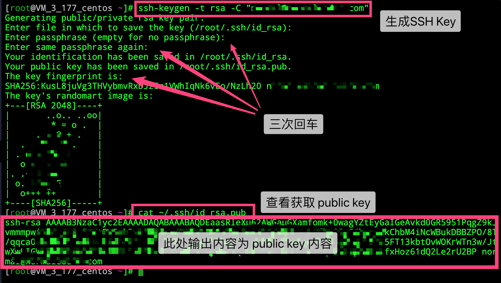
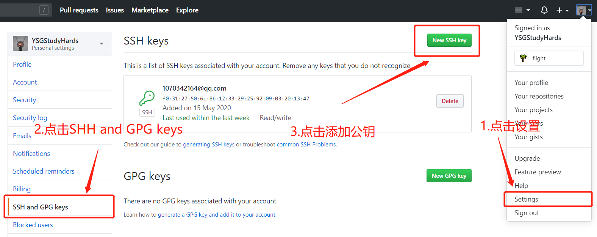
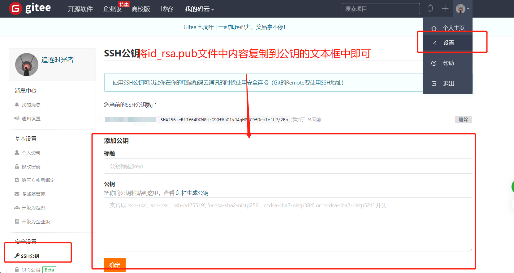
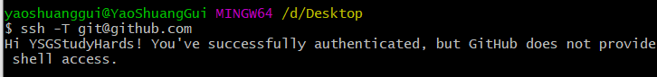

# Git 配置
### 设置本地全局个人信息（ubuntu）
```
git config --global user.email "you@example.com"
git config --global user.name "Your Name"
```
### 公钥配置
##### 1.生成并找到`SSH Key`
```
ssh-keygen -t rsa -C "xxxxx@xxxxx.com"  
```
按照提示敲击三次`Enter`键
查看获取的`public key`
```
cat ~/.ssh/id_rsa.pub
```


或者直接到C盘中找到`id_rsa.pub`文件（Windows）

##### 2.Github/Gitee 
Github


复制生成后的`ssh key`，通过`Settings` => `SHH and GPG keys`=> `New SHH key` 添加生成的 `SSH key` 添加到仓库中，如下图所示



Gitee

复制生成后的`ssh key`，通过仓库主页`管理`=>`部署公钥管理`=>`添加部署公钥`，添加生成的`public key`添加到仓库中，如下图所示：



在`Git Bash`终端验证`SSH Key`是否添加成功:
```
ssh -T git@github.com  //如果添加的是github
ssh -T git@gitee.com  //如果添加的是gitee
```
输出以下消息则表示成功：`Hi xxx! You've successfully authenticated, but GitHub does not provide shell access`.


